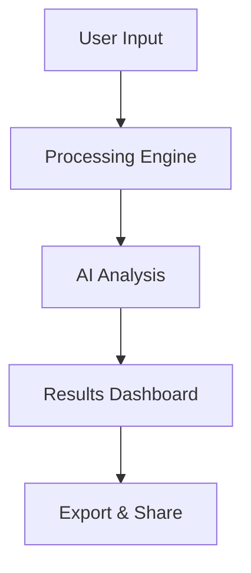

# Product Launch

## Introducing Our New Solution

**Your Name**  
**Your Company**  
**December 2024**

<!-- {"layout": "title"} -->

---

# Agenda

## What we'll cover today

- Problem overview
- Our solution
- Key features
- Market opportunity
- Demo
- Next steps

<!-- {"layout": "title-and-body"} -->

---

# The Problem

## Current challenges in the market

- **Complexity**: Existing solutions are too complex for most users
- **Cost**: High pricing barriers for small businesses  
- **Time**: Manual processes take too much time
- **Integration**: Poor compatibility with existing tools

> *"We surveyed 500 companies and found that 78% struggle with these issues daily"*

<!-- {"layout": "title-and-body"} -->

---

# Our Solution

## Simple, affordable, and fast

### Key Benefits:
- ⚡ **10x faster** than traditional methods
- 💰 **50% cost reduction** compared to competitors
- 🔧 **Easy integration** with popular tools
- 📱 **Works on any device**

[Learn more](https://your-product-website.com)

<!-- {"layout": "title-and-body"} -->

---

# Architecture Overview

## How it works under the hood



- **Step 1**: Users input their data through our intuitive interface
- **Step 2**: Our processing engine analyzes the information
- **Step 3**: AI provides insights and recommendations
- **Step 4**: Results are displayed in a beautiful dashboard

<!-- {"layout": "title-and-body"} -->

---

# Market Analysis

## Significant opportunity ahead

| Metric | Current | Projected (2025) | Growth |
|---------|---------|------------------|---------|
| Market Size | $2.5B | $4.8B | **92%** |
| Target Users | 50K | 200K | **300%** |
| Revenue/User | $500 | $750 | **50%** |

### Key Markets:
- 🏢 **Enterprise**: Large organizations (Fortune 500)
- 🏪 **SMB**: Small and medium businesses
- 👥 **Teams**: Remote and hybrid workforces

<!-- {"layout": "title-and-body"} -->

---

# Demo Time

## See it in action

<!-- This slide would typically contain a live demo or embedded video -->

**Live Demo Highlights:**
1. Quick setup (under 2 minutes)
2. Import existing data
3. Generate insights automatically
4. Share results with team
5. Export to multiple formats

*Demo will show real-world usage scenario*

<!-- {"layout": "section"} -->

---

# Competitive Advantage

## Why we're different

### **Traditional Solutions:**
- Complex setup process
- Expensive licensing fees  
- Limited customization
- Poor mobile experience

### **Our Approach:**
- ✅ **Instant setup**: Get started in minutes
- ✅ **Fair pricing**: Pay for what you use
- ✅ **Highly customizable**: Adapts to your workflow
- ✅ **Mobile-first**: Beautiful on any screen

<!-- {"layout": "title-and-body"} -->

---

# Customer Testimonials

## What our users say

> *"This tool transformed how our team collaborates. We've saved 20+ hours per week!"*  
> **— Sarah Johnson, CTO at TechCorp**

> *"The ROI was clear within the first month. Best investment we've made this year."*  
> **— Mike Chen, Operations Director**

> *"Finally, a solution that just works. No complex training needed."*  
> **— Lisa Rodriguez, Project Manager**

### 📊 **95% customer satisfaction** rating

<!-- {"layout": "title-and-body"} -->

---

# Pricing Plans

## Choose what works for you

### **Starter** - $29/month
- Up to 5 team members
- Basic analytics
- Email support
- 30-day free trial

### **Professional** - $79/month
- Up to 25 team members
- Advanced analytics
- Priority support
- Custom integrations

### **Enterprise** - Custom pricing
- Unlimited team members
- White-label options
- Dedicated support
- SLA guaranteed

<!-- {"layout": "title-and-body"} -->

---

# Next Steps

## Ready to get started?

### **For Developers:**
- 📚 Check out our [API documentation](https://docs.your-product.com)
- 🔧 Try our [interactive playground](https://playground.your-product.com)
- 📦 Install via npm: `npm install your-product-cli`

### **For Business Users:**
- 🚀 Start your [30-day free trial](https://your-product.com/trial)
- 📞 Book a [personalized demo](https://your-product.com/demo)
- 💬 Join our [community forum](https://community.your-product.com)

**Questions?** Contact us: hello@your-product.com

<!-- {"layout": "title-and-body"} -->

---

# Thank You

## Questions & Discussion

**Let's connect:**
- 🌐 Website: [your-product.com](https://your-product.com)
- 🐦 Twitter: [@yourproduct](https://twitter.com/yourproduct)
- 💼 LinkedIn: [Your Name](https://linkedin.com/in/yourname)
- 📧 Email: hello@your-product.com

<!-- {"layout": "title"} -->

---

# Bonus: Technical Deep Dive

## For the curious minds

### Code Example:
```python
from your_product import Client

# Initialize client
client = Client(api_key="your-api-key")

# Process data
result = client.analyze(data)

# Get insights
insights = result.get_insights()
print(f"Found {len(insights)} key insights")
```

### Performance Metrics:
- ⚡ **Response time**: < 100ms average
- 📊 **Accuracy**: 99.2% on standard benchmarks
- 🔄 **Uptime**: 99.99% SLA

*This slide can be skipped in shorter presentations*

<!-- {"layout": "title-and-body"} -->